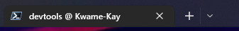

# devtools
This is  a collection of the dev tools I use 


> ## Terminal Propmt Design
This is a terminal prompt design on windows 10 and above...

***From Microsoft Store:***
1. install windows terminal 
2. install powershell 7.2.5 ( latest as of now..)
3. install oh-my-posh

***Installing using powershell:***

> ## Installation using winget:
```
winget install JanDeDobbeleer.OhMyPosh -s winget
Install-Module -Name oh-my-posh
Import-Module -Name oh-my-posh
```
 ## To activate [oh-my-posh](https://ohmyposh.dev/docs/installation/windows):
```
oh-my-posh init pwsh --config "$env:POSH_THEMES_PATH\jandedobbeleer.omp.json" | Invoke-Expression
```
## Next:
After installing oh-my-posh successfully, Type `notepad $PROFLIE` in powershell to create a config file in `Documents`

Now: 
Goto Documents and open the `PowerShell` folder and copy the contents of `config_files_ohmyposh` , paste it in there and click on replace all to continue.
## To Navigate to the path at which the themes are:
Type: `$env:POSH_THEMES_PATH` this will print a path like this
`C:\Users\PC_NAME\AppData\Local\Programs\oh-my-posh\themes`


Goto [Nerdfonts](https://www.nerdfonts.com/font-downloads) then download this font `FantasqueSanaMono Nerd Font` which has glyphs to help your terminal look like this:

5. after downloading the `Nerd Font` :
```
Press the Windows Button + R on the keyboard
Type:
C:\Windows\Fonts
Hit Enter on the keyboard
Extract the Nerd Fonts, copy the fonts and paste them in the fonts window to install the fonts.
```
6. click on the arrow point down then select setting from the dropdown:



7. after clicking on setting, navigate to `Appearance` in the `Windows Terminal ` downloaded from `Microsoft store` , then choose `font face` and select `FantasqueSanaMono NF`
8. Run this command to install [Terminal icons](https://github.com/devblackops/Terminal-Icons):
```
Install-Module -Name Terminal-Icons -Repository PSGallery
```
## Usage (Terminal icons):
```
Import-Module -Name Terminal-Icons
```
## To change an ohmyposh theme:

change/replace the file `config.omp.json` in 
```
oh-my-posh prompt init --config C:\Users\PC_NAME\AppData\Local\Programs\oh-my-posh\themes\1_shell.omp.json | Invoke-Expression
```
with your choice of themes in the folder ` C:\Users\PC_NAME\AppData\Local\oh-my-posh\config.omp.json` 